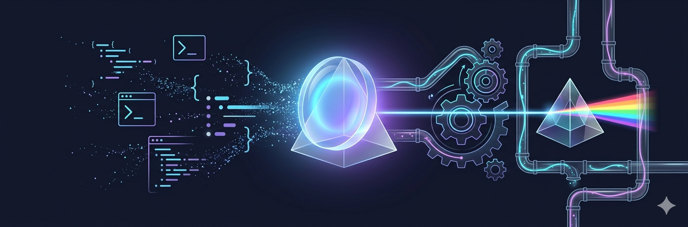

<div align="center">



# Gabe-Lens

**Cognitive translation layer for Claude Code**

Transforms technical explanations into physical analogies, spatial maps, and constraint boxes — built from reverse-engineering how one brain actually learns.

[](LICENSE)
[](https://github.com/khujta/gabe-lens)
[](https://github.com/khujta/gabe-lens)
[](https://github.com/khujta/gabe-lens/stargazers)

*Not a prompt template. Built from empirical self-observation.*

</div>

## See it in action

Ask `/gabe-lens enforcement tiers` and get this:

```
┌─── GABE BLOCK: Enforcement Tiers ──────────────────────┐
│                                                        │
│  THE PROBLEM                                           │
│  Rules written in docs get ignored under fatigue and   │
│  context loss. 19 files exceeded the 800-line limit    │
│  despite the limit being documented everywhere.        │
│                                                        │
│  THE ANALOGY                                           │
│  Think of it as gravity vs. posted speed limits.       │
│  Gravity (Tier 1 hooks) works whether you're paying    │
│  attention or not — drop a ball, it falls. Speed       │
│  limits (Tier 3 docs) only work if the driver reads    │
│  the sign AND chooses to comply. Tier 2 (workflows)    │
│  is like a speed bump — it slows you down IF you       │
│  drive over it, but you can take a different road.     │
│                                                        │
│  THE MAP                                               │
│                                                        │
│    Tier 1: GRAVITY ══════════════════► Always works    │
│    (hooks)    PreToolUse ─→ fires every edit           │
│               pre-commit ─→ fires every commit         │
│                                                        │
│    Tier 2: SPEED BUMPS ─ ─ ─ ─ ─ ─ ─► Works if used    │
│    (workflows) /review ─→ only if invoked              │
│                                                        │
│    Tier 3: POSTED SIGNS · · · · · · ·► Often ignored   │
│    (docs)     CLAUDE.md rules ─→ lost after compaction │
│                                                        │
│  CONSTRAINT BOX                                        │
│    IS:      A reliability classification for rules     │
│    IS NOT:  A quality judgment (Tier 3 rules aren't    │
│             bad rules — they're just badly placed)     │
│    DECIDES: Where to invest enforcement effort —       │
│             convert Tier 3 lessons into Tier 1 hooks   │
│                                                        │
│  ONE-LINE HANDLE                                       │
│  "Hooks are gravity — docs are speed limit signs"      │
│                                                        │
│  SIGNAL: Quick check ✓                                 │
│  (The concept is intuitive once you see the tiers.     │
│   Don't overthink — the tier system IS the insight.)   │
└────────────────────────────────────────────────────────┘
```

That one-line handle — *"Hooks are gravity — docs are speed limit signs"* — stuck for weeks. The original 3-paragraph explanation didn't last a day.

## Install

Inside Claude Code:

```
/plugin marketplace add khujta/gabe-lens
/plugin install gabe-lens@khujta-gabe-lens
```

Or clone locally: `git clone https://github.com/khujta/gabe-lens.git && claude --plugin-dir ./gabe_lens`

## Usage

### Full block (default)

```
/gabe-lens [concept or question]
```

All components: problem, analogy, map, constraint box, one-line handle. ~200-350 tokens.

### Brief

```
/gabe-lens bf [concept]
```

Constraint box + one-line handle only. ~40-80 tokens. For previously introduced concepts.

### Oneliner

```
/gabe-lens ol [concept]
```

Just the memorable phrase. ~5-15 tokens. For compaction handoffs or re-anchoring.

### Annotate a document

```
/gabe-lens an [file-path]
```

Reads a file and produces a companion with Gabe Blocks for the 3-5 most critical concepts.

### Session map

```
/gabe-lens map
```

Spatial map of current work state: DONE / NOW / NEXT with one-line handles.

## Compression modes

| Context | Mode | Command | Tokens |
|---|---|---|---|
| First encounter with a concept | Full | `/gabe-lens` | ~200-350 |
| Referencing a known concept | Brief | `/gabe-lens bf` | ~40-80 |
| Compaction handoff or re-anchoring | Oneliner | `/gabe-lens ol` | ~5-15 |

## Analogy domains

Physical systems you can visualize in 3D, in preference order:

1. **Mechanical** — gears, valves, pulleys
2. **Fluid dynamics** — pressure, flow, reservoirs
3. **Optics** — lenses, mirrors, refraction
4. **Chemistry** — reactions, catalysts, equilibrium
5. **Electromagnetism** — fields, circuits, charges
6. **Thermodynamics** — heat, entropy, engines
7. **Biology** — cells, ecosystems, evolution

If no good physical analogy exists, the skill says so explicitly rather than forcing a weak metaphor.

## Embedding in workflows

```yaml
project_knowledge:
  optional:
    - "skills/gabe-lens/SKILL.md"
```

One-line handles also enhance compaction handoff notes by surviving context compression.

## The origin story

<details>
<summary>How gabe-lens was built from a cognitive self-observation experiment</summary>

gabe-lens started as a personal experiment: **what happens when you use AI to reverse-engineer how your own brain learns?**

I sat down with Claude and deliberately tried to learn a complex topic — attention mechanisms in neural networks. But the real goal wasn't understanding attention. It was watching *how my mind processed* the explanation, in real time, and having Claude observe and document the patterns.

What we discovered:

- **I don't reach for equations — I reach for metaphors.** When learning how Query/Key/Value works in transformers, I spontaneously generated analogies: spheres reflecting light onto each other, chemical reactions with temperature and state. These weren't decorations — they were my primary reasoning substrate.

- **I reason top-down, not bottom-up.** My mind asks "why does this exist?" before "how does it work?" Purpose first, constraints second, mechanism last.

- **I learn in spirals.** Constrained prototype → generalize → formalize → refine. I don't need complete understanding to start.

- **I have an overthinking trap.** When a correct answer comes fast, I spiral searching for hidden complexity that isn't there. The IS NOT field in constraint boxes was designed specifically to short-circuit this.

These were patterns observed during actual learning exercises, documented in real time. Once we had the cognitive profile, the next question was obvious: can we turn this into a reusable format?

The learning profile became the SKILL.md. The explanation sequence (Problem → Analogy → Code) became the Gabe Block. The overthinking trap mitigation became the constraint box. The one-liners I remembered days later became the one-line handles.

</details>

## License

MIT
